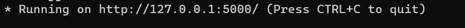
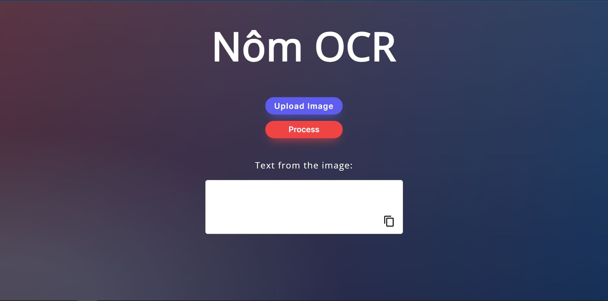
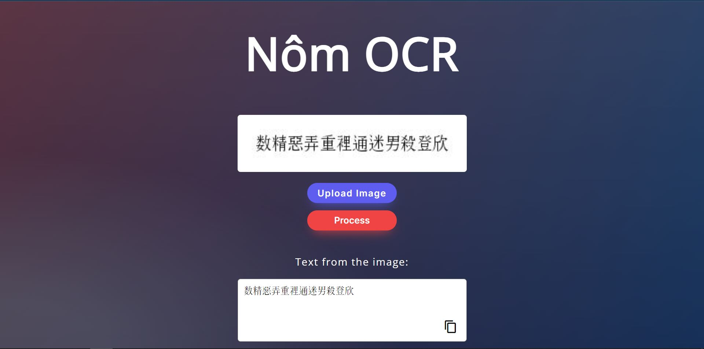

## Dependencies
**Environment**: Python 3.7

You **must install** these Python libraries:
- [Numpy](https://numpy.org/)
```
pip install numpy
```
- [OpenCV](https://github.com/opencv/opencv-python)
```
pip install opencv-python
```
- [Keras](https://keras.io/)
```
pip install tensorflow
```
- [Flask](https://flask.palletsprojects.com/en/2.0.x/)
```
pip install Flask
```
## Running the project
1. Run app.py using below command to start Flask API

```
python app.py
```

Wait until you see this line in your terminal:



By default, flask will run on port 5000.

2. Navigate to URL http://localhost:5000

You should be able to view the homepage as below:


Upload an image that you need to process and hit the `Process` button.
**You can use the images in *test* folder**.

If everything goes well, you should be able to see the predcited texts in the given image on the page!


You can copy the texts just by clicking on copy button!